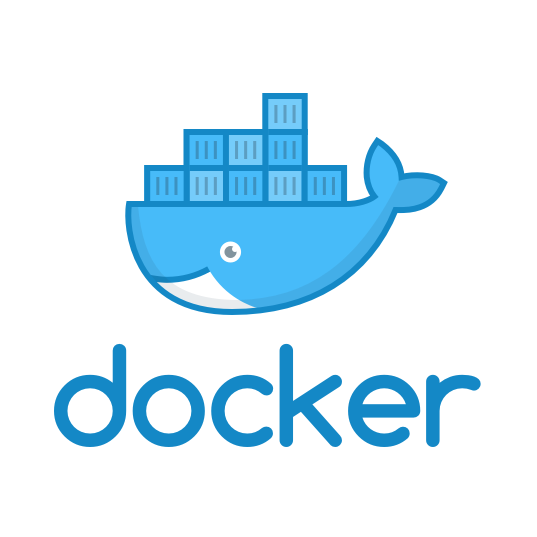

# Docker :whale:
 도커의 간단한 개념과 도커파일 작성법을 알아보자 on 20-04-07

## 도커란?
 컨테이너 기반 오픈소스  
 
## 컨테이너란?
 리눅스 컨테이너는 운영체제 수준의 가상화 기술로 리눅스 커널을 공유하면서 프로세스를 격리된 환경에서 실행하는 기술을 의미  
 하드웨어를 가상화하는 가상 머신과 달리 커널을 공유하는 방식이기 때문에 실행 속도가 빠르고, 성능 상의 손실이 거의 없다는 장점  

## 도커 이미지와 컨테이너
 이미지는 실행파일, 컨테이너는 프로세스  

## 도커를 사용하는 이유
 운영하면서 만들어지는 Snowflake Servers를 방지 하기 위함
 이미지로 만들어 놓으면 여러 사람이 공유,재활용 가능
 배포에서 발생되는 이슈를 줄여 개발에 집중하기 위해

## Dockerfile (파일에 자체 DSL Domain-specific language) 
 Docker Image를 생성하기 위해 명령어로 작성된 문서  
 Container 내부 환경을 정의함  

## Docker download on CentOS
 1. yum -y update
 2. yum -y install docker docker-registry  
 (docker-registry 는 도커 이미지를 공유하기 위한 서버 애플리케이션)
 3. systemctl enable docker.service  
 4. systemctl start docker.service  

## 자주 사용하는 Docker 문법
 - docker image ls (실행중인 도커 이미지 확인)  
 - docker run -it -d --name tomcatcontainer -p 80:8080 sangwondocker/tomcat8 (컨테이너 백그라운드로 실행)  
 - docker build -t [Name Of the Image]  . (Dockerfile 배포)  

